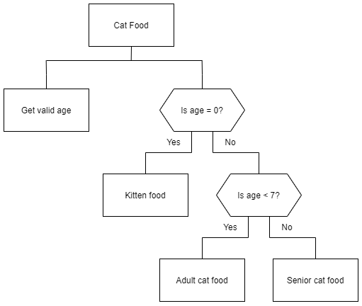

# N5 SDD - Cat Food

## Introduction

Write a program that allows a user to enter the age of their cat in (human) years.  Depending on its age, display the appropriate food to feed it, using the table below:

| Type of cat | Age of cat | Type of food |
| --- | :---: | --- |
| Kitten | <1 | Kitten food |
| Cat | 1 - 6 | Adult cat food |
| Senior | 7+ | Senior cat food |

## User Experience

Examples below.

### Example 1
```
How old is the cat? 0

Your cat is 0 years old
Feed it kitten food.
```

### Example 2
```
How old is the cat? 56
Enter an age from 0 - xx
How old is the cat? 5

Your cat is 5 years old.
Feed it adult cat food.
```

Note: ___xx___ is the upper limit that you choose

## Structure diagram



## Notes
Ensure that the age of the cat is valid.  How long, approximately, can cats live?

Before writing the program decide how to test it!

Be sure to use:

1. Meaningful identifiers
2. Internal commentary
3. Whitespace
4. Indentation