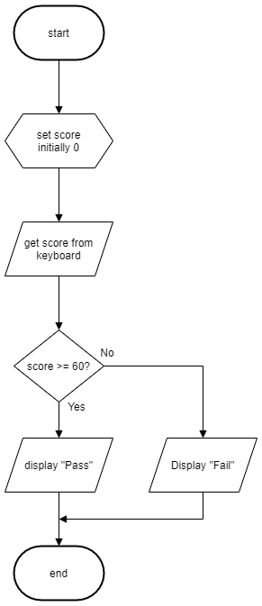

# N5 SDD - Test Result v1

## Introduction

A user wants an automatic decision system that will classify a test score as either a '__Pass__' or a '__Fail__'.  A score of 60 or more is a pass, and anything else as a fail.

## Tasks

1. Create a comprehensive test plan for the program.  Use OneNote.

2. Implement a program that matches the flowchart below.  Ensure the code is efficient.

3. Use the test plan to check that the program works correctly.

4. Ensure the code is readable by using:

   1. Meanigful identifiers.
   2. Internal commentary.
   3. Whitespace.

### Assumptions

All scores are whole numbers.

## User Experience

Below is an example of the expected user experience.

```Python
  Enter test score: 60  
  Grade: Pass  
```

## Flowchart
