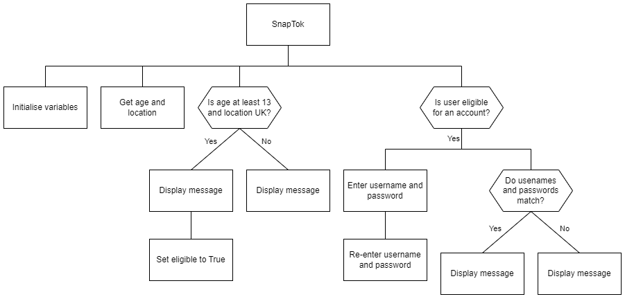

# N5 SDD - SnapTok

## Introduction

Barra's very own Meta, Beta (pronounced ___better___), is looking to break into the finacially lucrative social media market.  It is in the early stages of design but Beta has an idea for an app that will be called __SnapTok__.

To avoid issues with other tech companies __SnapTok__ will initially only be for UK users.  To comply with UK law, users must be at least 13 years old to create an account.  If the app was available in Europe then users would need to be at least 16 years old to comply with European law!

## Analysis

A program is required to create a user account.  The user will enter their age and location.  The program will determine if they are eligible for an account and display an appropriate message.  If the user is eligible they will enter a username and password.  They will re-enter the username and password.  The program will determine if the information matches and display an appropraite message.

### Inputs

* age
* location
* username (twice)
* password (twice)

### Processes

* Decide if eligible for an account
* Decide if:
    * usernames match
    * passwords match

### Outputs

* Message for anyone ineligible for an account
* Message for usernames or passwords not matching
* Message for successful account creation

## Design

A structure diagram is shown below for creating an account.



## User Interface

Examples of the expected user interface are shown below.

### Example 1

```
Enter your age: 13
Enter your location: uk

You are eligible for a SnapTok account.

Choose a username: topCat
Choose a password: hotdog

Re-enter username: topCat
Re-enter password: hotdog

Welcome to SnapTok!
```

### Example 2

```
Enter your age: 13
Enter your location: uk

You are eligible for a SnapTok account.

Choose a username: sillySausage           
Choose a password: ketchup

Re-enter username: sillysausage
Re-enter password: ketchup

User details do not match - Goodbye!
```

### Example 3

```Enter your age: 12
Enter your age: 12
Enter your location: ussr

You are not eligible for a SnapTok account.
You must be at least 13 years old and in the UK.

Goodbye!
```

## Assumptions

* All numbers are integers
* All text is lower case
