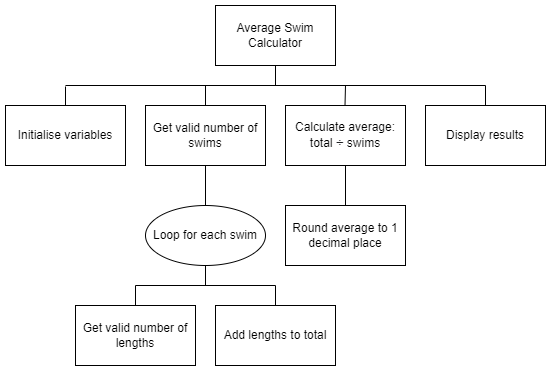

# N5 SDD - Swimming

## Introduction

A swimming club wants a program that will calculate the average number of lengths a person swims in a week.

## Anlaysis

Because the pool is very popular, a person is allowed:

* only 1 swim each day
* a maximum of 100 lengths per swim

The program will only be used if a person swims more than once in a week.

### Average Calculation

Average lengths = Total lengths ÷ Number of swims

## Instructions  

Using the structure diagram, implement the code and test it.

This task will practise using:

* Input validation
* Running total
* Rounding
* Concatenation

To improve the readability of the program, use:

* Meaningful identifiers
* Internal commentary
* White space
* Indentation

## Structure diagram

  

## User Interface

### Example 1

```
How many swims? 2

Swim 1 lengths? 6

Swim 2 lengths? 9

15 lengths were swum over 2 swims.
An average of 7.5 lengths per swim.
```

### Example 2

```
How many swims? 1
Number of swims must be from 2 to 7

How many swims? 2

Swim 1 lengths? 0
Number of lengths must be from 1 to 100

Swim 1 lengths? 101
Number of lengths must be from 1 to 100

Swim 1 lengths? 1

Swim 2 lengths? 100

101 lengths were swum over 2 swims.
An average of 50.5 lengths per swim.
```
