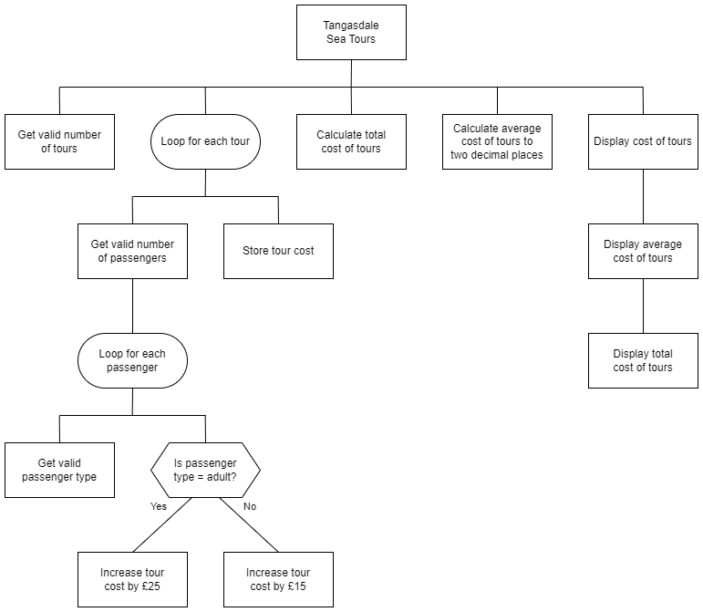

# N5 SDD - TST


## Introduction

Tangasdale Sea Tours (TST) is a small business that does popular tours along the west coast of Barra, with the slogan "__West is Best!__".  When the weather is good enough, TST runs up to 4 tours a day, two before lunch and two after lunch.  Each tour has space for 5 passengers, which can be any mixture of adults and children.  An adult ticket is £25 and a child ticket is £15.

At the end of the day the overall takings are calculated from the tickets sold, and an average per tour is caluclated.

## Analysis

### Inputs

* Number of tours
* Number of passengers on a tour
* Passenger type


### Processes

* Calculate cost of each tour
* Caculate cost of all tours
* Calculate average cost of a tour (Cost of all tours / Number of tours)
* Round average cost to 2 decimal places


### Outputs

* Cost of each tour
* Average cost of tours
* Total cost of tours

An example of the expected output is shown below.

### Assumption

* Passenger type is lowercase


### Design (Structure diagram)




#### Expected output

```
Tours
-----

1:  £80
2:  £85
3: £115

Avg: £93.33
Total: £280
===========
```


## Task

Using the program analysis and the design, implement the program in a language of your choice.
