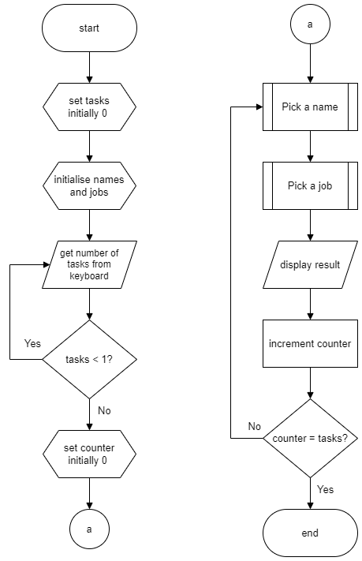

# N5 SDD - Task Picker


## Introduction

Very few people enjoy doing chores.  There are different ways of organising them: a rota, leave them until someone buckles, lucky dip, ...


## Task

Using the flowchart below, implement a program that will ask how many tasks need doing and pick a name and a task for each of them.


### Top level design (Flowchart)




### Example user interface

``` python
Task Picker
-----------

How many tasks? 3

Emma will clean the cat litter
Tom will clean the toilet
Phil will wash the car

Enjoy!
======
```
