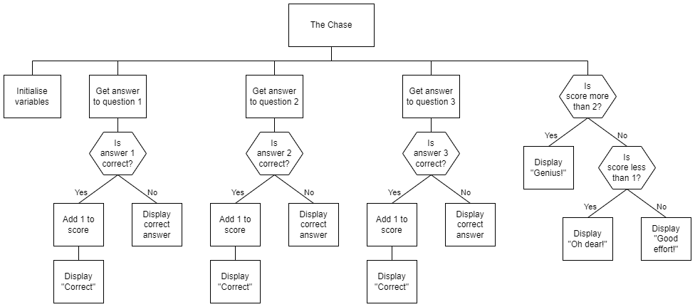

# N5 SDD - The Chase

A popular TV quiz show was planning on coming to Barra.  Unfortunately, due to a combination of weather and equipment faults none of the production team was able to get here.


## Task

To save the day you are to produce a program that will ask questions, show the correct answers if wrong, and then give a result.

As a proof of concept, the initial program will ask three questions.  Implement the design shown below.


## Top level design (Structure diagram)




### Example User Interface

```
The Chase
---------

What animal says 'meow'? cat
Correct!

What animal says 'woof'? dog
Correct!

What animal says 'oink'? pig
Correct!

Genius!
=======
```