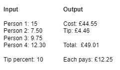
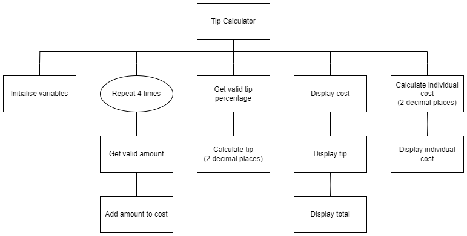

# N5 Tip Calculator

## Introduction

Write a program that will help 4 friends work out the cost of a meal, how much to tip, the total, and how much each will pay when they split the bill equally.

The 4 friends never have a meal that costs anyone more than £25, and never tip more than 20%.

## User Experience

## Structure diagram

## Maths

To calculate the tip:

&nbsp;&nbsp;&nbsp;&nbsp;tip = cost &#215; (tip percent &#247; 100) 

## Notes

Be sure to use:

1. Meaningful identifiers
2. Internal commentary
3. Whitespace
4. Indentation