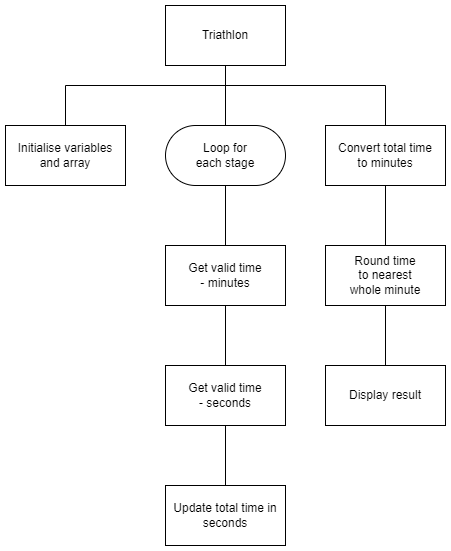

# N5 SDD - Triathlon


## Introduction

A triathlon is being planned for Barra. A 'Super Sprint' triathlon has 5 sections (3 stages and 2 transitions):

1. Swim - 400 m
2. Transition 1 (T1)
3. Cycle - 10 km
4. Transition 2 (T2)
5. Run - 2.5 km

The time from each section is added together to give the overall time for the triathlon.  The transitions, T1 and T2, are time taken to change from one stage to another.

As the Barra triathlon is for fun, there will be no cut off times for any of the stages.  


## Task

Implement the design shown below.  An example of the user interface is also shown.  Unfortunately, the mins and seconds for each section need to entered seperately.


### Top level design (Structure diagram)

  


### Example user interface

```
Barra Triathlon
---------------

Enter times for each stage:

Swim time (min): 12
Swim time (sec): 58

T1 time (min): 1
T1 time (sec): 05

Cycle time (min): 30
Cycle time (sec): 58

T2 time (min): 0
T2 time (sec): 45

Run time (min): 19
Run time (sec): 01

Total: 65 mins
==============
```
