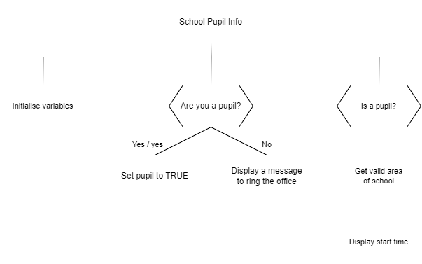

# N5 SDD Tasks - Summer 2024

## Introduction

There are over seven weeks between classes in June and August.  There are four tasks below, about one every other week, to complete over the break.

Replit will switch off the Education element at the end of July, so make sure your code is still accessible when this happens.  An option would be to use [Thonny ](https://thonny.org/) and save your code to OneDrive.

## Task 1

Write a program to ask the user for a value and then display the square root of the value.  Only positive values are acceptable.  If the square root is an integer display it with no trailing zeros, otherwise round it to 3 decimal places.

__Note__:  9 to the power of `0.5` = 3

### Example 1

#### Input

```
Enter a value: 25
```

#### Output

```
The square root is: 5
```


### Example 2

#### Input

```
Enter a value: 26
```

#### Output

```
The square root is: 5.099
```

## Task 2

Write a program to help with addition.  Ask how many numbers are to be added together, and the maximum value  of any number.  The only 2 to 5 numbers can be added together.  The maximum value must be positive.

Create and display a list of random numbers that meet the criteria.

Ask the user for the sum of the values, and display an appropriate message.

__Note 1__: `\n` = new line
__Note 2__: `\t` = tab

### Example 1

#### Input

```
How many numbers: 3
Largest number: 9
```

#### Output

```
Add the following numbers together:
  1  5  9

What is the sum? 15

Correct!
```

### Example 2

#### Input

```
How many numbers: 4
Largest number: 100
```

#### Output

```
Add the following numbers together:
  100  1  10  73

What is the sum? 183

Wrong.  It's 184!
```

## Task 3

Write a program to ask the user if they are a pupil of Castlebay School.  The program must be able to accept the answers of `Yes` and `yes`.  Any other answer will display a message to phone the office.  Pupils will be asked where are they a pupil (Nursery, Primary, or Secondary) and display the time they start school in the morning (8.30&nbsp;am, 8.55&nbsp;am, or 8.50&nbsp;am).

### Structure Diagram



### Example 1

#### Input

```
Are you a pupil at Castlebay School? No
```

#### Output

```
Phone 810100, Mon-Fri, after 9.30 am.
```

### Example 2

#### Input

```
Are you a pupil at Castlebay School? yes

Where are you a pupil? Nursery
```

#### Output

```
Your learning fun starts at 8.30 am.
```

## Task 4

Create a line of poetry generator.  Each line is to be in the format:

```
<determiner> <adjective> <noun> <verb> <adverb>.
```
Each time the program is run, a random line of poetry is created.

### Examples

```
A blue wind slept playfully.
```

```
My big seagull ate slowly.
```

```
The rainbow dog slept happily.
```

__Tip__ Five arrays are needed.  More elements in each array, the more random the poetry.
