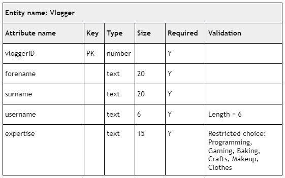

# N5 CS 2019 Task 1 Part B

File: [vlogger.db](assets/Vlogger.db "Download file")

## Task

___1b___ Using the data dictionary below complete the Vlogger table by adding the validation.

(__2 marks__)

Print evidence to show that you have added both validations to the Vlogger table.

* Check your evidence carefully, as you cannot return to part B after you hand it in.
* When you are ready, hand part B and collect part C.
