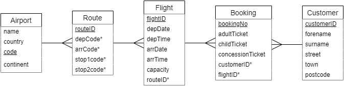

# N5 DDD Flights

## Introduction

Loganair has decided to expand where it flies to.  To save on costs it will work with another airline that already has a booking system that it can make use of.

The design of the database is shown below.



Every airport has a 3-letter code to identify it, i.e. `BRR` is the code for Barra , and `LHR` is the code for London Heathrow.

The database contains a number of routes.  Every route holds the airport code for the depature airport (`depCode`) and the code for the arrival airport (`arrCode`).

Some routes stop at other airports on the way.  If there are any stops, then `mid1code`, and possibly `mid2code` will contain airport codes.

If there are no stops, then `mid1code` and `mid2code` will hold a special value of `NULL` to show that they are empty.

Loganair will use `routeID`s starting from 8000.

## Tasks

1. Using the Airport table, display all the details for Glasgow airport (GLA).

2. Using the Route table, display all the details for routes that depart from Glasgow.

3. Display all the details for airports that planes from Glasgow fly to or stop at.

4. Due to an oversight, the Barra airport has not been included in the Airport table; even though it has more runways than Heathrow!

Add Barra (BRR) to the airport table using the the following details:

``` sql
"Barra", "United Kingdom", "BRR", "Europe"
```

{:start="5"}
5. Display the information that was just added.

6. The Barra (BRR) to Glasgow (GLA) route is not in the database.  There are no stops in between.  Add the following values to the Route table:

``` sql
8000, "BRR", "GLA", NULL, NULL
```

{:start="7"}
7. Add the return journey so that people can get home.  Use the next number for the `routeID`.

8. Display all the information that was added for the two routes.

9. Loganair wants to expand its reach in the UK.  Add a route that flies from Barra to Bristol with stops at Glasgow and then Birmingham.

10. Add the return route.

11. Display all the information that was added for the two routes.

12. Loganair is thinking about adding routes that go to Denmark.  Display the following information for all airports in Denmark.

| name | code |
| ---- | ---- |
|      |      |

{:start="13"}
13. Add a route for the 'Legoland Express' that will depart Barra for Billund in Denmark, going via Glasgow.

14. Add the return journey.

15. Display all the information that was added for the two routes.

16. Add a Barra to Glasgow flight to the Flight table using the following details:

```
flightID: LM0456
depDate: 2024-02-02
depTime: 14:55:00
arrDate: 2024-02-02
arrTime: 16:05:00
capacity: 18
routeID: 8000
```

{:start="17"}
17. Add the return flight, LM0451, on 4<sup>th</sup> Feb 2024.  It will depart Glasgow at 10:15 am, and land at 11:30 am, and has the same number of seats.

18. Display all the information that was added for the two flights.  Display the flights with the earliest flight first.

19. Using the Flight and Route tables, display only the following details for flights LM0456 and LM0451:

| flightID | depCode | arrCode | depDate | depTime | arrTime |
| -------- | ------- | ------- | ------- | ------- | ------- |
|          |         |         |         |         |         |

Ensure the departure dates are ascending.

{:start="20"}
20. Find your details in the Customer table.  Take a note of your `customerID`.

21. Using a single statement, update your details with the following information:

* 112 High Street
* Castlebay
* HS9 5XD

{:start="22"}
22. Display all of your details.

23. Display all the information in the Booking table.  Order the primary key field so that the values are ascending.

24. Using the next `bookingNo`, book yourself onto flight LM0456 as two adults and three children.

25. Book everyone on the return flight LM0451.

26. Display all of your bookings.

27. Using the Flight and Booking tables, display only the following information for your bookings:

| bookingNo | flightID | depDate | depTime |
| --------- | -------- | ------- | ------- |
|           |          |         |         |

{:start="28"}
28. Using the Route, Flight, and Booking tables, display only the following information for your bookings:

| bookingNo | flightID | depCode | depDate | depTime |
| --------- | -------- | ------- | ------- | ------- |
|           |          |         |         |         |

{:start="29"}
29. Using the Airport, Route, Flight, and Booking tables, display only the following information for your bookings:

| bookingNo | flightID | name | depDate | depTime |
| --------- | -------- | ---- | ------- | ------- |
|           |          |      |         |         |

30. Add a flight for the Legoland Express, Barra to Billund:

```
flightID: LLX112
depDate: 2024-03-15
depTime: 14:55:00
arrDate: 2024-03-15
arrTime: 20:05:00
capacity: 24
```

{:start="31"}
31. Add the return flight, LLX911, on 17<sup>th</sup> Mar 2024.  It will depart Billund at 12:15 am, and land at 3:30 pm, and has the same number of seats.

32. Using the next `bookingNo`, book yourself onto the Legoland Express to Billund as two adults and three children.

33. Book everyone on the return flight.

34. Display only the following information for your bookings to and from Billund:

| bookingNo | flightID | name | depDate | depTime |
| --------- | -------- | ---- | ------- | ------- |
|           |          |      |         |         |
