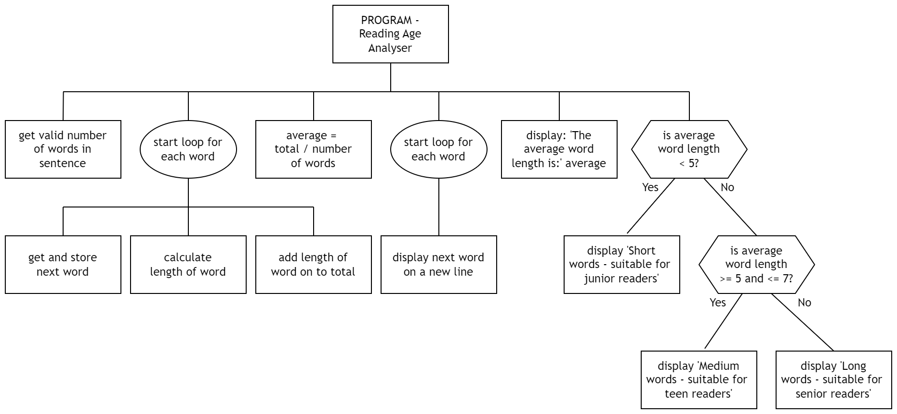
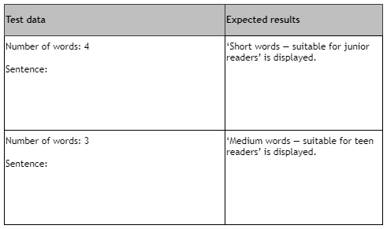

# N5 CS 2024 Specimen Task 1C

[Orignally 2021 ==> 2021 Specimen ==> 2024 Specimen]: # 

The measurement of how easy a sentence is to read is called the reading age.  One method of calculating this is to use the average length of the words in the sentence.

So the longer the average word length, the higher the reading age.

## Program analysis

A program is required to calculate the approximate reading age (junior, teen or senior) of a single sentence with a maximum of 20 words. The user will enter each word of the sentence, one at a time. The program will then calculate the average word length and display an appropriate message.

### Inputs

* number of words (in sentence) to be entered
* each word in the sentence

### Processes 

* calculate the average word length (total number of characters divided by number of words)
* decide which message to display

### Outputs 

* each word in the sentence displayed on a new line one appropriate message from: 

    * Short words — suitable for junior readers
    * Medium words — suitable for teen readers
    * Long words — suitable for senior readers

## Program design (structure diagram)



___1c___ Using the program analysis and the design, implement the program in a language of your choice.

Ensure the program matches the completed structure diagram.

Print evidence of your program code. (__15 marks__)

___1d (i)___ You should test your program to ensure it produces the expected output.

Use the following data to check that the message ‘Long words — suitable for senior readers’ is displayed:

```
Number of words:   5
Words in sentence: distressed
                   tourists
                   wandering
                   around
                   aimlessly
```

Run your program to show that it produces the correct message.

Print evidence of the test run showing inputs and outputs. (__1 mark__)

___1d (ii)___ Additional test data is required to check that the other two messages are also displayed correctly.

Complete the test table below with data that could be used to produce the other two messages. (__2 marks__)



___1e___ With reference to your code, evaluate your program by commenting on the following:

* Efficiency of your program code (__1 mark__)
* Readability of your program code (__1 mark__)