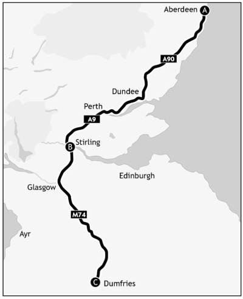
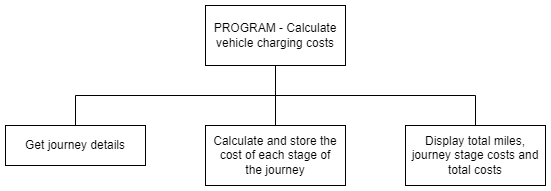
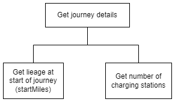
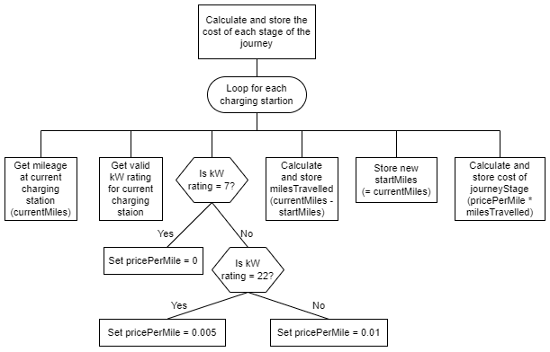
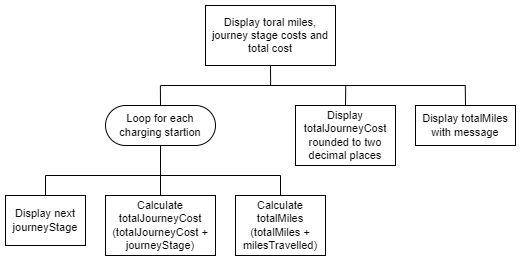
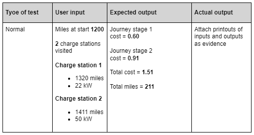
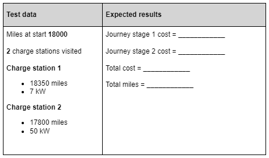

# N5 CS 2023 - Task 1 Part B

## Introduction

EVcharge is a company that runs an electric vehicle charging network. It requires a program to provide users with a summary of their journey, and to calculate the cost for using the charging network. 

## Program analysis

At the end of the journey, details are submitted to EVcharge to calculate the final cost.

### Inputs

* The vehicle mileage at the start of the journey.
* The number of charging stations visited.
* A valid kilowatt (kW) rating for each charging station (7kW, 22kW or 50kW).
* The vehicle mileage at each charging station.

For example, if making the journey from Aberdeen to Dumfries via Stirling (shown in the diagram below), the user would enter:

* the vehicle mileage at the start of the journey (A)
* that two charging stations were visited (B and C)
* the kW rating of each of the two charging stations
* the vehicle mileage at each of the two charging stations (B and C) 

  
### Process

* Calculate the number of miles travelled in each stage of the journey.
* Calculate the cost of each stage of the journey using the number of miles travelled and the cost per mile, based on the kW rating of the charging station as shown below:
    * 7kW = £0 per mile
    * 22kW = £0.005 per mile
    * 50kW = £0.01 per mile
* Calculate the total number of miles travelled from the start to the end of the journey.
* Calculate the total cost for the journey.

### Outputs

* The total number of miles travelled.
* The cost (£) of each stage of the journey.
* The total cost (£) rounded to two decimal places.

### Assumption(s)

* The user will complete the journey using no more than 10 charging stations.

## Program design (structure diagram)

### Main steps

### Refinement of ‘Get journey details’

### Refinement of ‘Calculate and store the cost of each stage of the journey’

### Refinement of ‘Display total miles, journey stage costs and total cost’

__1b__	Using the program analysis and the design, implement the program in a language of your choice.

Ensure the program matches the structure diagram given. (___15 marks___)

Print evidence of your program code.	

__1c(i)__  Your program should be tested to ensure it produces the correct output.

Use the test data provided below to check that your program produces the correct output.

Print evidence of the test showing inputs and outputs.  (___1 mark___)

__1c(ii)__	In the test data below, the mileage entered at Charge station 2 is not correct.

Complete the test table below — this will show that the program is not fit for purpose.  (___2 marks___)

__1c(iii)__   With reference to the test data above, describe how to make the program fit for purpose. (___1 mark___)
