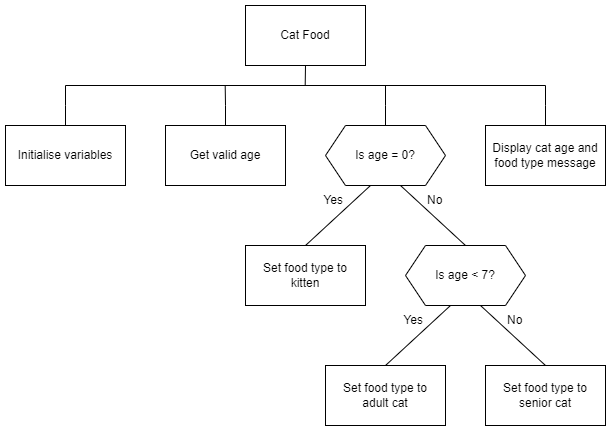

# N5 SDD - Cat Food


## Introduction

Implement a program that macthes the structure diagram below.  It will allow a user to enter the age of their cat in (human) years.  Depending on its age, display the appropriate food to feed it, using the table below:

| Type of cat | Age of cat | Type of food |
| ----------- | :--------: | ------------ |
| Kitten      | < 1        | Kitten food |
| Cat         | 1 - 6      | Adult cat food |
| Senior      | 7+         | Senior cat food |


## Structure diagram




## User interface

### Example 1

```
Cat Food Selector
-----------------

How old is the cat? 0

Your cat is 0 years old
Feed it kitten food.

Meow!
=====
```

### Example 2

```
Cat Food Selector
-----------------

How old is the cat? 56

Enter an age from 0 - xx
How old is the cat? 5

Your cat is 5 years old.
Feed it adult cat food.

Meow!
=====
```


## Notes

Ensure that the age of the cat is valid.  How long, approximately, can cats live?

___xx___ Example 2 is the upper limit that you choose.
