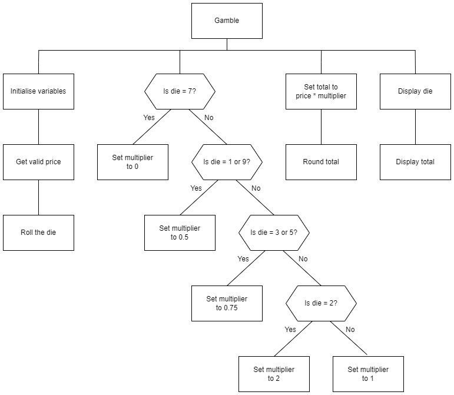

# N5 SDD Gamble

## Introduction

Padula's is runnning a small promotion where purchases under £5 can be entered into a prize draw.  A ten sided die (1-10) is rolled and the number that is shown decides the result.

The rules of the promotion are:

1. Only purchases less than £5 are eligible.
2. Playing is completely optional, as there is a risk of paying more!
3. Prizes:
	* 7 - free
	* 1 or 9 - 50% off
	* 3 or 5 - 25% off
	* 4, 6, 8, 10 - full price
	* 2 - double price!

This all worked fine until someone complained about how the die was rolled, and they had to pay double.

A small program is now needed to replace the physical die.


## Top level design (Structure diagram)




## User experience

```
Padula's Lucky Die
------------------
Only play if you can afford to lose.
Throw a 2 and pay double!
------------------

Price: £2.94

You threw a 1
So you pay: £1.47

Have a nice day!
----------------
```
