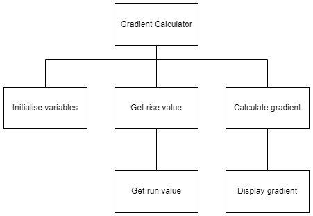

# N5 SDD - Gradient Calculator


## Task

Use the structure diagram to implement a program that will calculate the gradient when a user enters the __rise__ and the __run__.


### Top level design (Structure diagram)




### Calculate gradient


### Example use interface

``` python
Gradient Calculator
-------------------

Rise: 2.5
Run: 10.0

Gradient: 0.25
=============
```
