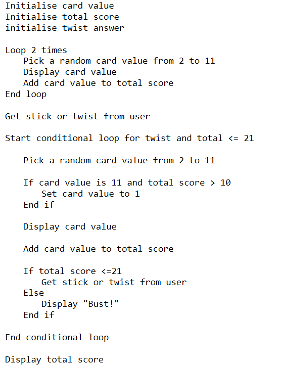

# N5 SDD - Pontoon

## Introduction

Pontoon is a popular card game, which is also known as Spanish 21 and Blackjack. It’s usually played with between two and eight players.

Pontoon uses standard decks of 52 playing cards and the aim is to beat the dealer by having a hand closer to 21 than the dealer without going bust.  A total of 22 ormore is bust.

## Task

Using the pseudocode below, implement code to create a simple game of Pontoon.

### Top leve design (Pseudocode)

