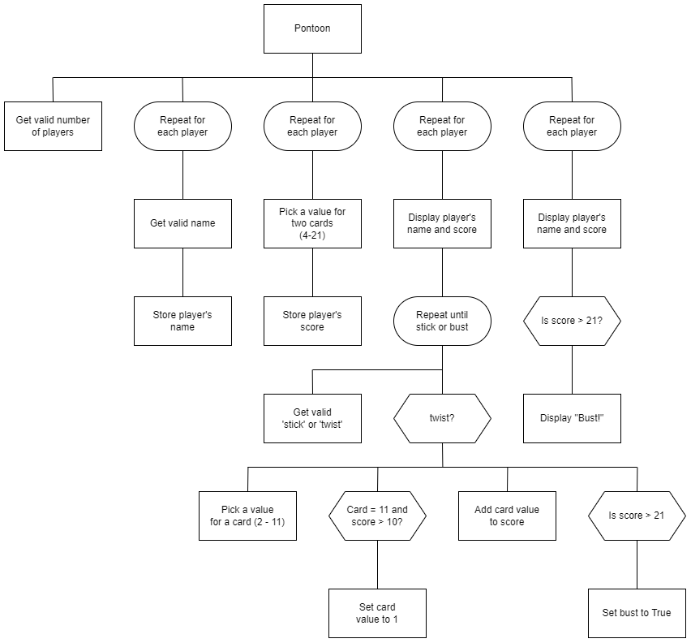

# N5 SDD - Pontoon Part 2

## Introduction

Pontoon is a popular card game, which is also known as Spanish 21 and Blackjack. It’s usually played with between two and eight players.

Pontoon uses standard decks of 52 playing cards.  Each player is dealt two cards.  Each player in turn will either `twist` or `stick`.  If they twist they are dealt another card.  This continues until the player sticks or go bust.  A player has bust if they score 22 or more.

## Card values

* Number cards: face value
* Picture cards: 10
* Ace: 1 or 11

## Task

Using the Structure diagram below, implement code to create a simplified version of the Pontoon.

### Top leve design (Structure diagram)

