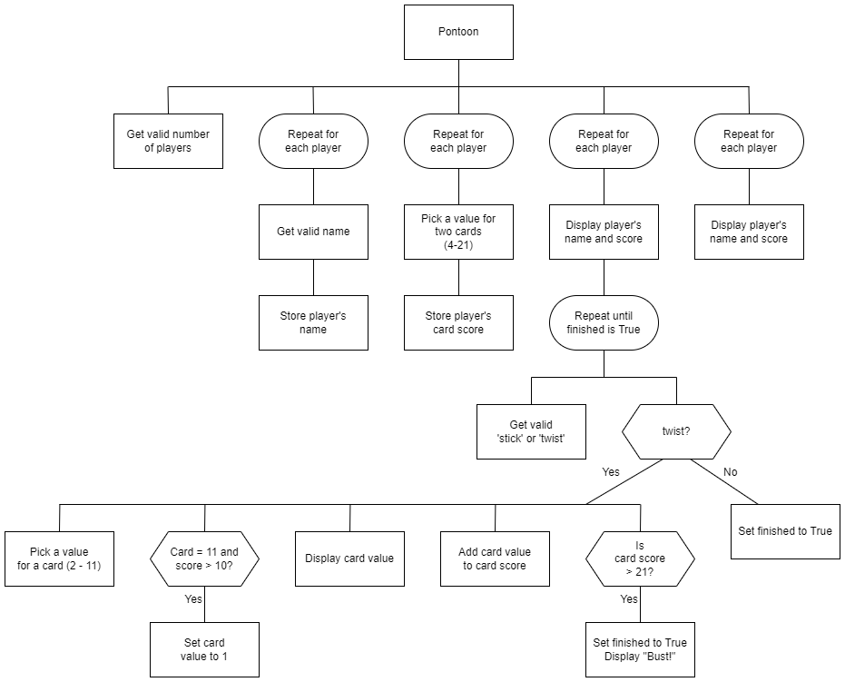

# N5 SDD - Pontoon Part 2


## Introduction

Pontoon is a popular card game, which is also known as Spanish 21 and Blackjack. It’s usually played with between two and eight players.

Pontoon uses standard decks of 52 playing cards.  Each player is dealt two cards.  Each player, in turn will, either `twist` or `stick`.  If they twist they are dealt another card.  This continues until the player sticks or go bust.  A player has bust if they score more than 21.


## Card values

* Number cards: face value
* Picture cards: 10
* Ace: 1 or 11


## Analysis

### Inputs

* Number of players - minimum of 2 letters
* Names of players
* Stick or twist

### Processes

* Calculate value of first two cards for each player
* Add value of new card(s) to each player's score

### Outputs

* Players' Names
* Players' scores

### Assumptions

* `twist` and `stick` are lowercase


## Task

Using the Structure diagram below, implement code to create a simplified version of the Pontoon.


### Top leve design (Structure diagram)




### Example user interface

#### Input

```
Pontoon
-------

How many players? 2

Enter names
-----------
Player 1: Jim
Player 2: Jo
```


#### Output

```
Results
-------
Jim: 23
Jo: 21
=======
```
