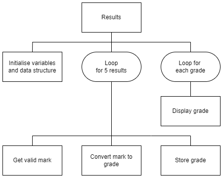

# Test Result v4

## Introduction

A user wants an automatic grading system that will classify a test score using the table below.  Only scores from ___0___ to ___100___ are acceptable.

| Mark    | Grade |
| ----    | :---: |
| 70+     | A |
| 60 - 69 | B |
| 50 - 59 | C |
| 40 - 49 | D |
| 0 - 39  | No Award |

The grades are to be stored so they can be used later.


## Tasks

1. Create a comprehensive test plan for the program.

2. Implement a program that matches the structure diagram below.

3. Use the test plan to check that the program works correctly.


### Top level design (Structure diagram)




### Example user interface

#### Input

```
Grade Calculator
----------------
Mark 1: 65
Mark 2: 45
Mark 3: 85
Mark 4: 20
Mark 5: 55
```

#### Output

```
Grades
------
Grade 1: B
Grade 2: D
Grade 3: A
Grade 4: No Award
Grade 5: C
==========
```
