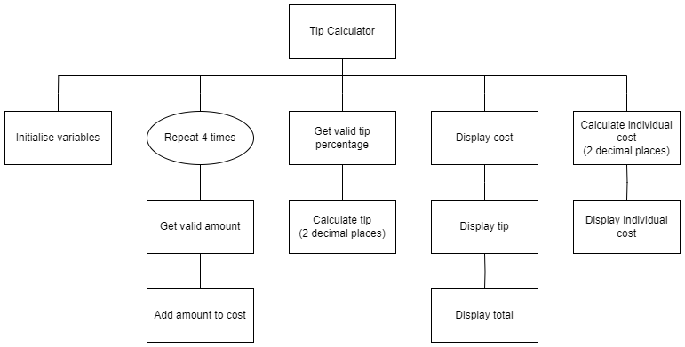

# N5 SDD - Tip Calculator

## Introduction

A group of four friends often go out for a meal together and split the bill equally.  An individual meal never costs more than £25, and the friends never tip more than 20%.

## Task

Using the top level design below, write a program that will help the friends work out the combined cost of the meals, how much to tip, and the total cost.  Finally, calculate how much each person will pay when they split the bill.

### Top Level Design (Structure diagram)



### Example User Interface

```
Meal Costs
----------
Person 1: 15
Person 2: 7.50
Person 3: 9.75
Person 4: 12.30

Percentage
----------
Tip percent: 10


Group
-----
Meal:  £44.55
Tip:   £4.46
-------------
Total: £49.01
=============


Individual
----------
  £12.25
  ======
```

### Maths

To calculate the tip:

&nbsp;&nbsp;tip = cost &times; (tip percent &divide; 100) 
