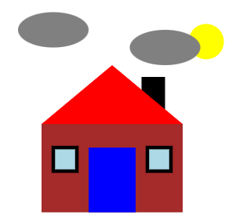

# N5 WDD - SVG Practise

## Task

Using SVG, create an image similar to the one below.



## SVG

### Line

``` html
<line x1="20" y1="20" x2="180" y2="180" style="stroke:red;stroke-width:2" />
```

### Rectangle

``` html
<rect x="110" y="110" width="60" height="40" fill="blue" style="stroke-width:3;stroke:red"/>
```

### Ellipse

``` html
<ellipse cx="100" cy="100" rx="40" ry="50"  fill="yellow" style="stroke:green;stroke-width:3" />
```

### Polygon

``` html
<polygon points="100,10 150,150 50,150" fill="blue" style="stroke:purple;stroke-width:3" />
```

## Basic Page

Just in case!

``` html
<!DOCTYPE html>
<html lang="en-gb">

<head>
  <title>SVG Practise</title>
</head>

<body>

    <!-- Ensure canvas is big enough for image -->
    <svg width="200" height="200" xmlns="http://www.w3.org/2000/svg">

    <!-- Add the SVG shapes below here -->


    </svg>

</body>

</html>
```
