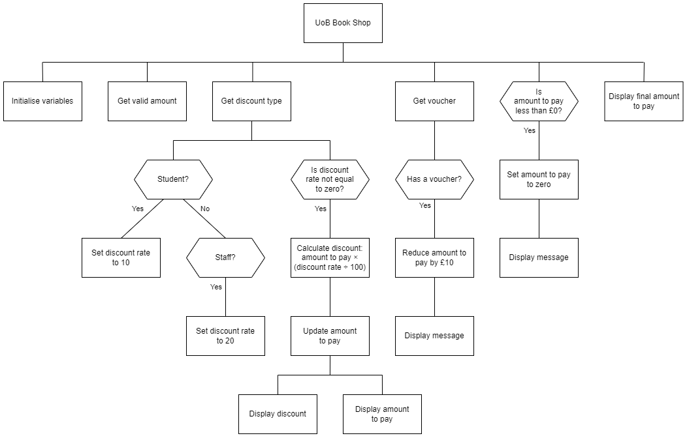

# N5 SDD - Book Shop Part 2


## Introduction

The University of Barra (UoB) bookshop is upgrading its software.  There is a wide selection of items for sale in the shop, ranging from a minimum of £5 up to a maximum of £100.  To help staff and students with the cost they get a discount.  The book shop will accept a gift voucher to pay for all or some of the purchase.  Only one £10 gift voucher can be used per purchase.  When using a voucher, no change is given if the amount to pay is less than £10.


## Task

Use the structure diagram to implement a program that will accept a non-discounted amount, calculate the discounted price if appropriate, and then take into account using a voucher to pay for some, or all, of the amount.


## Top level design (Structure diagram)




## Assumptions

1. The initial amount will be entered as pounds:

* £10 as 10
* 50p as 0.50

2. Any text entered is lower or upper case, i.e. yes, YES, staff, STAFF, ...

3. Any rounding will be done by the UoB bookshop staff.


## Examples

Examples of the expected user interface are shown below with some possible input and output values.


### User Interface

#### Example 1

```
UoB Book Shop
-------------

Total amount: £10

Discount? STUDENT

Discount: £1.0
Amount to pay: £9.0

Voucher? yes

£10 voucher applied
No change given when using a voucher

Final amount to pay: £0.0
====================
```

#### Example 2

```
UoB Book Shop
-------------

Total amount: £7.25

Discount? no

Voucher? NO

Final amount to pay: £7.25
====================
```

#### Example 3

```
UoB Book Shop
-------------

Total amount: £25.50

Discount: staff

Discount: £5.1
Amount to pay: £20.4

Voucher? YES

£10 voucher applied

Final amount to pay: £10.4
====================
```
