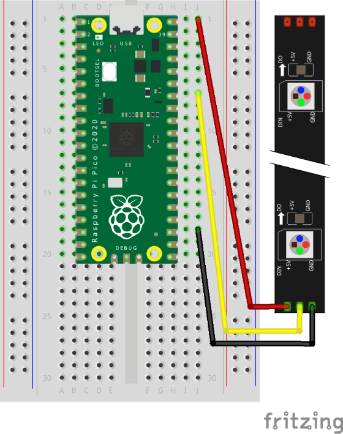

# Neopixels

## Layout



## Code

``` python
# Title: Neopixel Example
# Author: Mr Friend
# Date: 8 Nov 2024

# Note: Kitronik ZIP Stick, 35129 - 5 LEDS

# Get extra code
import machine
import time
from neopixel import NeoPixel

# Connection values
gpio = machine.Pin(28)
noOfPixels = 5

# Setup LEDs
pixels = NeoPixel(gpio, noOfPixels)

# Colours - Quarter brightness
red =    (64, 0, 0)
green =  (0, 64, 0)
blue =   (0, 0, 64)
yellow = (64, 64, 0)
cyan =   (0, 64, 64)
black =  (0, 0, 0) 
white =  (64, 64, 64)

colours = [red, yellow, green, cyan, blue, white]


# Display each colour in turn
for index in range(len(colours)):
    
    # All LEDs the same colour
    pixels.fill(colours[index])
    
    # Display LEDs
    pixels.write()
    
    # Short pause
    time.sleep(1)


# Set individual LED colours
pixels[0] = blue
pixels[1] = yellow
pixels[2] = green
pixels[3] = cyan
pixels[4] = red

# Display LEDs
pixels.write()


# Loop forever
while True:

    # Rotate LEDs
    for counter in range(noOfPixels):

        # Short pause
        time.sleep(1)

        # Get colour of first LED
        tempPixel = pixels[0]

        # Loop for reamining LEDs
        for index in range(noOfPixels-1):
            
            # Move colour from one LED to next
            pixels[index] = pixels[index+1]
            
        # Set colour of last LED    
        pixels[noOfPixels-1] = tempPixel

        # Display LEDs
        pixels.write()


```
