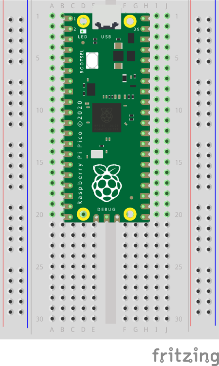

# Pico - Internal LED

Uses the picozero library to control the onboard LED.


## Install picozero library

Install the picozero library, if not already installed.

[Instructions](https://projects.raspberrypi.org/en/projects/introduction-to-the-pico/4 "RPi website"). 


## Layout




## Code

``` python
# Get extra code
from picozero import pico_led
from time import sleep


# Loop forever
while True:
    
    # Turn LED on
    pico_led.on()
    
    # Pause
    sleep(0.5)
    
    
    # Turn LED off
    pico_led.on()
    
    # Pause
    sleep(0.5)
 ```
