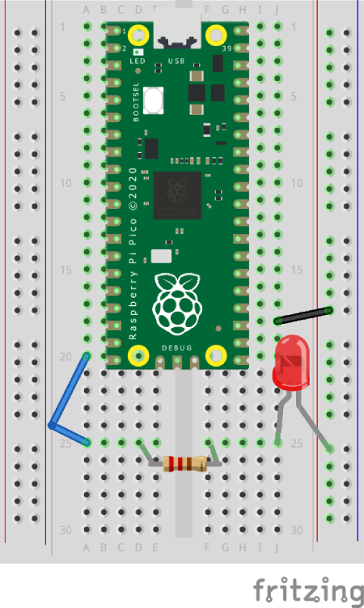

# Pico - External LED

Uses the picozero library to control a LED.


## Install picozero library

Install the picozero library, if not already installed:
[Instructions](https://projects.raspberrypi.org/en/projects/introduction-to-the-pico/4 "RPi website").


## Layout




## Code

``` python
# Get extra code
from picozero import LED
from time import sleep


# Setup the pin to control the LED
led = LED(15)


# Loop forever
while True:
    
    
    # Turn LED on
    led.on()
    
    # Pause
    sleep(0.5)
    
    
    # Turn LED off
    led.off()
    
    # Pause
    sleep(0.5)
 ```
