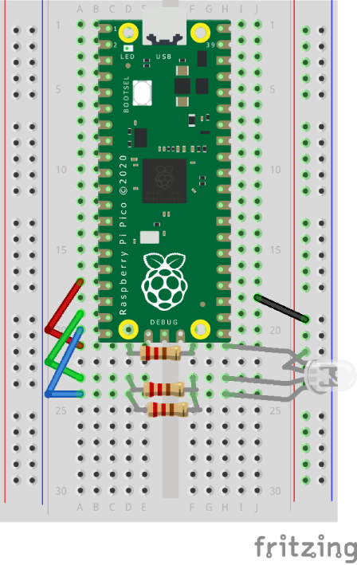

# RGB LED

Uses the picozero library to control a RGB LED.


## Install picozero library

Install the picozero library, if not already installed:
[Instructions](https://projects.raspberrypi.org/en/projects/introduction-to-the-pico/4 "RPi website"). 


## Layout




## Code

``` python
# Get extra code
from picozero import RGBLED
from time import sleep


# GPIO pins for RGB LED
rgb = RGBLED(13, 14, 15)


# Declare RGB Colours
black = (0, 0, 0)  # All off
red = (255, 0, 0)
green = (0, 255, 0)
blue = (0, 0, 255)
white = (255, 255, 255)  # All on

# Declare array
colours = [red, green, blue, white, black]


# Loop forever
while True:
    
    # Show each colour in turn
    for colour in colours:
        rgb.color = colour
        sleep(0.5)
    
    
    # Get brighter
    for counter in range(256):
        rgb.color = (counter, counter, counter)
        sleep(0.005)
    
    
    # Get dimmer
    for counter in range(256):
        rgb.color = (255-counter, 255-counter, 255-counter)
        sleep(0.005)
        
    sleep(0.5)
 ```
