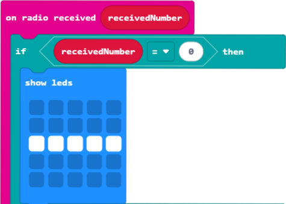

# S1 SDD - Morse Code

## on start

### Set up the radio

Pick a radio group that you will send and receive messages on.  It can be from `0` to `255`.

## Transmit

### Send a dash

Send the number `0` to represent a dash, and display something on the screen to show that the button has been pressed.

### Send a dot

Send the number `1` to represent a dot, and display something on the screen to show that the button has been pressed.

### Send a dot

Send the number `2` to represent the end of a letter, and display something on the screen to show that the buttons have been pressed.

## Receive

When a number is received use logic to show the correct symbol.

### Receive a dash

When the number 0 is received, show a dash on the screen.

