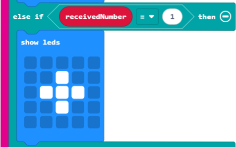

# S1 SDD - Morse Code

## Introduction

This code uses the micro:bit V2 to produce the Morse Code dash and dot sounds, but will work on the micro:bit V1 without the sounds.

## On start

### Set up the radio

Pick a radio group to send and receive messages on.  It can be from `0` to `255`.

## Transmit

### On button A pressed

Send the number `0` to represent a dash, and display something on the screen to show that the button has been pressed.

### On button B pressed

Send the number `1` to represent a dot, and display something on the screen to show that the button has been pressed.

### On button A+B pressed

Send the number `2` to represent the end of a letter, and display something on the screen to show that the buttons have been pressed.

## On radio received

When a number is received use logic to show the correct symbol.

### If number is 0

When the number `0` is received, show a dash on the screen.

### Else, if number is 1

When the number `1` is received, show a dot on the screen.

### Else

When a number that is not a `0` or a `1` is received, show a symbol on the screen.

### Sound

The micro:bit V2 has a built in speaker that can be used to hear the 'dots' and 'dashes'

#### Dash

#### Dot

#### End

