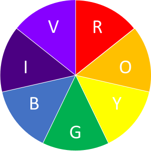
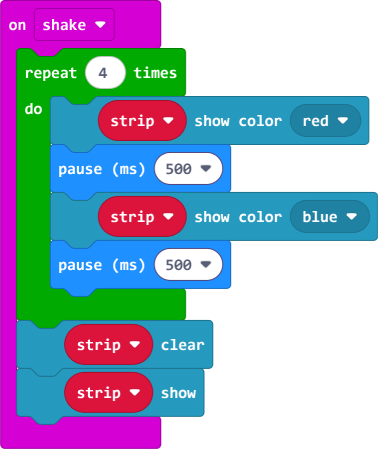

# S1 SDD - NeoPixels

## Introduction

A [micro:bit](https://makecode.microbit.org/) can be used to control [NeoPixels](https://www.adafruit.com/category/168).

## Set up

### Extra Code

The `neopixel` extension needs to be installed.
This is accessed via `Extensions`.

The required extension is then selected.

### On start

To set up the NeoPixel the `Neopixel at pin` block is used.  The default values are:

* variable name is `strip`
* pin for commands is `P0`
* number of LEDs is 24

The number of LEDs needs to be changed to the number of actual LEDs.

## Display

### On button A pressed

To change all the LEDs to one colour, `show color` is used.
Various colours are available in the drop down list.

### On button B pressed

To change all the LEDs to a rainbow, `show rainbow` is used.

To only use part of a rainbow, adjust the numbers `1 to 360` to something else, e.g. `90 to 180`.

### On button A+B pressed

To rotate all the LEDs on the strip, `rotate pixels by` is used.
The LEDs will not rotate until the `show` command is used.

Compare with `shift pixels by`.

### On shake

To make the LEDs flash a loop is used, with a short pauses after a change of colour.

To turn the LEDs off `clear` is used.
The LEDs will not turn off until the `show` command is used.

