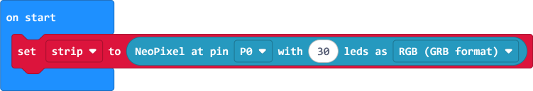
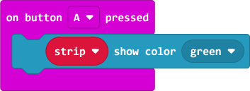
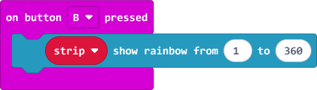
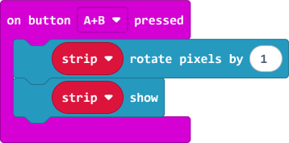

# S1 SDD - NeoPixels

## Introduction

A micro:bit can be used to control [NeoPixels](https://www.adafruit.com/category/168).

## Set up

### Extra Code

The `neopixel` extension needs to be installed.

### On start

To set up the NeoPixel the `Neopixel at pin` block is used.  The default values are:

* variable name is `strip`
* pin for commands is `P0`
* number of LEDs is 24

## Display

### On button A pressed

To change all the LEDs to one colour, `show color` is used.  Various colours are available in the drop down list.

### On button B pressed

To change all the LEDs to a rainbow, `show rainbow` is used.

### On button A+B pressed

To rotate all the LEDs on the strip, `rotate pixel by` is used.
Nothing will until the `show` command is used.

