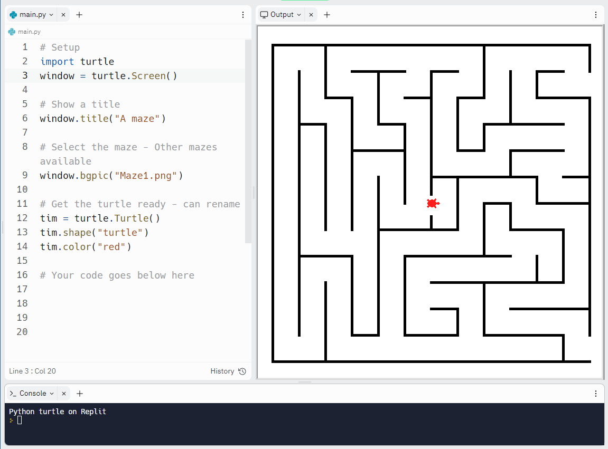

# S2 SDD - Turtle Maze

## Escape the Maze!

How quickly can your turtle escape the maze?  No cheating, the turtle can't go through, over, or under the walls!

__Tip:__  Have the `Output` window to the right of the `main.py` window, and the `Console` below.

When your turtle escapes the first maze copy the code into `maze1.py`, and change line `9` to `Maze2.png`.  Can you complete all three mazes?

## Turtle Instructions

### Movement

| Instruction | Example | Comment |
| ----------- | ------- | ------- |
| forward() fd() | tim.forward(75) tim.fd(75) | move forward |
| backward() bk() | tim.backward(25) tim.bk(25) | move backward |
| right() rt() | tim.right(75) tim.rt(75) | turn right (degrees) |
| left() lt() | tim.left(75) tim.lt(75) | turn left (degrees) |
| speed() | tim.speed(5) | speed: 0 to 10 |
| setheading() seth() | tim.setheading(45) tim.seth(45) | direction: 0 = East |

### Drawing

| Instruction | Example | Comment |
| ----------- | ------- | ------- |
| dot() | tim.dot(5) tim.dot(5, "red") | dot with size dot with size and colour |
| stamp() | tim.stamp() | stamps the turtles shape |
| color() | tim.color("green") | change colour |