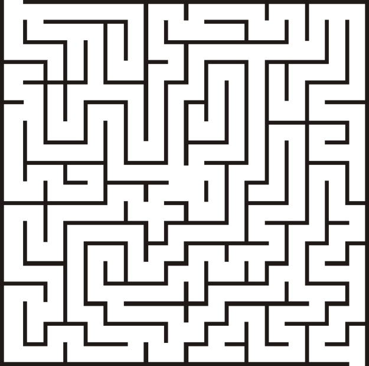
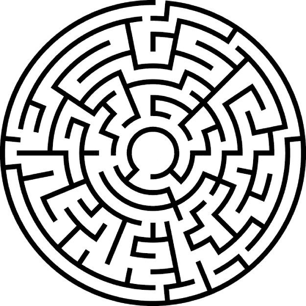

# S2 SDD - Turtle Maze


## Escape the Maze!

How quickly can your turtle escape the maze?  No cheating, the turtle can't go through, over, or under the walls!

### Starter code

``` pyhton
# Title: Turtle Maze 1
# Author: 
# Date: 

# Get extra code
import turtle

# Create the screen
screen = turtle.Screen()

# Name the screen
screen.title("Maze 1")

# Add the maze asa background image
screen.bgpic("Maze1.png")

# Create the turtle
tim = turtle.Turtle()
tim.shape("turtle")
tim.color("red")

# Code to escape goes below here

```


### Mazes

Maze 1: 

Maze 2: 

Maze 3: 

When your turtle escapes the first maze create a new file called `maze2.py`, and change the image to `maze2.png`.

___Note:___ Note the different file extensions, __.py__ and __.png__

Can you complete all three mazes?


## Turtle Instructions

### Movement

| Instruction            | Example                            | Comment |
| -----------            | -------                            | ------- |
| forward()<br>fd()      | tim.forward(75)<br>tim.fd(75)      | move forward |
| backward()<br>bk()     | tim.backward(25)<br>tim.bk(25)     | move backward |
| right()<br>rt()        | tim.right(75)<br>tim.rt(75)        | turn right (degrees) |
| left()<br>lt()         | tim.left(75)<br>tim.lt(75)         | turn left (degrees) |
| speed()                | tim.speed(5)                       | speed: 0 to 10 |
| setheading()<br>seth() | tim.setheading(45)<br>tim.seth(45) | direction: 0 = East |


### Drawing

| Instruction | Example                         | Comment |
| ----------- | -------                         | ------- |
| dot()       | tim.dot(5)<br>tim.dot(5, "red") | dot with size<br>dot with size and colour |
| stamp()     | tim.stamp()                     | stamps the turtles shape |
| color()     | tim.color("green")              | change colour |
