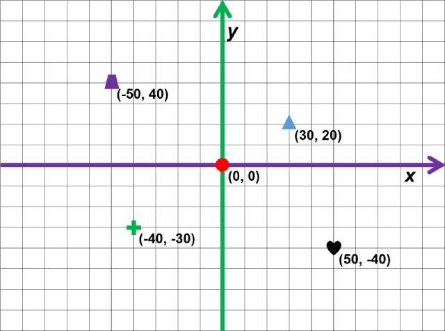

# Python Turtle

## Introduction

The turtle can be given instructions.  If the turtle understands an instruction it will carry it out.  It carrys them out in order, starting at `Line 1`.  Blank lines are allowed, even encouraged to make the instructions easier to read.

As the turtle moves it will draw a line on the screen, unless it has been told not to.

## Comments

Comments can be added to the code, but they are ignored by the computer. 
 Comments have a `#` symbol at the start of them.

``` python
# This is a comment.  It is ignored.

# Comments are for humans!
```

## Starting

After an appropriate comment, enter the following code to be able to use a turtle.

``` python
import turtle
```

Now create a new turtle and give it a name.  This one will be called `tim`.  Any name came be used but spaces are not allowed.

``` python
tim = turtle.Turtle()
```

## Example Code

### Forward

The turtle's name must be used so it know that an instruction is for it.  To move the turtle forward a distance the following code is used.

``` python
tim.forward(75)
```

There are a few parts to this:

1. Turtle's name: `tim`
2. Dot, without spaces: `.` 
3. Instruction: `forward()`
4. Distance: `75`

### Turn

To turn the turtle left a number of degrees the following code is used.

``` python
tim.left(90)
```

## Turtle Instructions

Turtles understand quite a few instructions.

### Movement

| Instruction            | Example                            | Comment |
| -----------            | -------                            | ------- |
| forward()<br>fd()      | tim.forward(75)<br>tim.fd(75)      | move forward |
| backward()<br>bk()     | tim.backward(25)<br>tim.bk(25)     | move backward |
| right()<br>rt()        | tim.right(75)<br>tim.rt(75)        | turn right (degrees) |
| left()<br>lt()         | tim.left(75)<br>tim.lt(75)         | turn left (degrees) |
| speed()                | tim.speed(5)                       | speed: 0 to 10 |
| home()                 | tim.home()                         | move to centre of screen |
| setheading()<br>seth() | tim.setheading(45)<br>tim.seth(45) | direction: 0 = East |
| goto()                 | tim.goto(20, 40)                   | move to a position (x, y) |

### Drawing

| Instruction       | Example                         | Comment |
| -----------       | -------                         | ------- |
| penup()<br>pu()   | tim.penup()<br>tim.pu()         | stop drawing |
| pendown()<br>pd() | tim.pendown()<br>tim.pd()       | start drawing |
| circle()          | tim.circle(10)                  | circle with radius |
| dot()             | tim.dot(5)<br>tim.dot(5, "red") | dot with size<br>dot with size and colour |
| stamp()           | tim.stamp()                     | stamps the turtles shape |
| color()           | tim.color("green")              | change colour |
| clear()           | tim.clear()                     | clears the screen |
| begin_fill()      | tim.begin_fill()                | start filling shapes |
| end_fill()        | tim.end_fill()                  | stop filling shapes |

### Other

| Instruction | Example             | Comment |
| ----------- | -------             | ------- |
| shape()     | tim.shape("turtle") | Change turtle's shape |

### Colours

Programming languages normally use American spelling, so the command for colour is misspelt as `color`.

Turtles can draw with lots of different colours, such as `red`, `green`, `blue`, `yellow`, etc.

For longer list of colours visit: [Turtle Colours](https://cs111.wellesley.edu/reference/colors "Turtle colors")

## Grid

The grid uses cooridinates in the form __(__ ___x___, ___y___ __)__.
The centre of the grid, `home()`, is __(__ ___0___, ___0___ __)__.
Some example coordinates are shown below.



## Example Shapes

### Square

``` python
for step in range(4):
    tim.forward(40)
    tim.right(90)
```

### Triangle

``` python
for step in range(3):
    tim.forward(40)
    tim.right(120)
```

### Multisided
``` python
sides = 10
for step in range(sides):
    tim.forward(40)
    tim.right(360/sides)
```

## Initial Code

If it all goes horribly wrong, copy and paste the code below.

``` python
# Title: S2 SDD Turtle
# Author: 
# Date: 

# Get code to use a turtle
import turtle

# Create a turle and give it a name
tim = turtle.Turtle()
```


## Compass Rose

Just for info.

